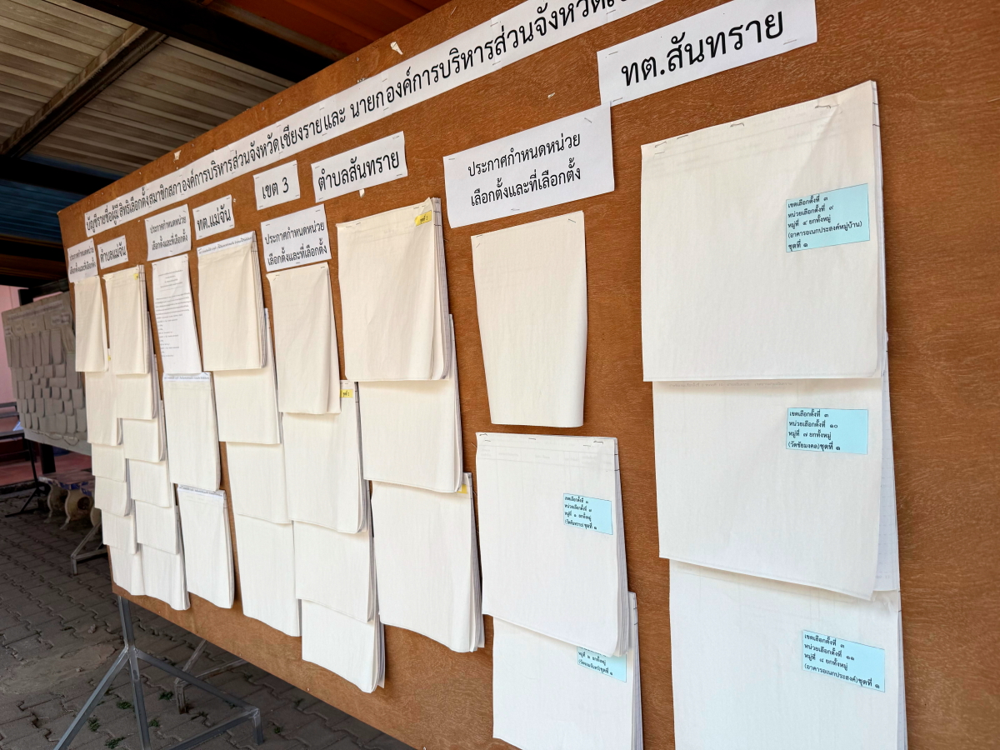
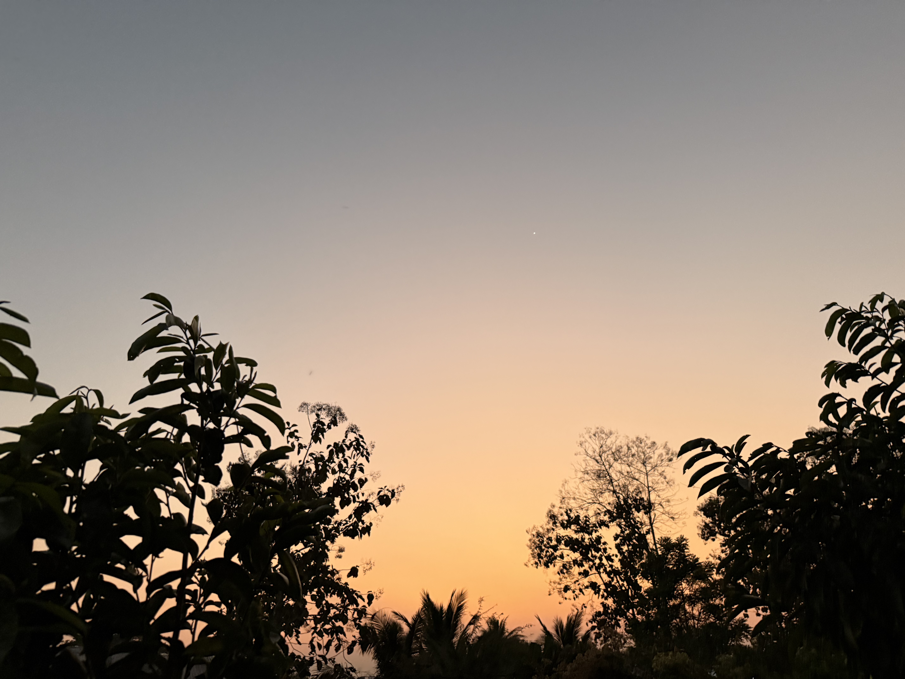

# 20250205_chiangrai

<html>
<head>

<meta charset="UTF-8">
<meta http-equiv="Content-Type" content="text/html; charset=UTF-8">
<meta http-equiv="X-UA-Compatible" content="IE=EmulateIE10" />
<meta http-equiv="X-UA-Compatible" content="IE=edge">

<!--ここから上はお決まりの定型文です-->

<!--ここからが表現の書式などを決めるcssという部分-->

<link href="https://cdnjs.cloudflare.com/ajax/libs/lightbox2/2.7.1/css/lightbox.css" rel="stylesheet">

</head>

<body>

モバイル端末をお使いの場合は、画面を横向きにすると
より見やすくご覧頂けます。

<!--ここ上は、ほぼそのまま使います！-->

<!--QRコードの挿入例-->

 アクセス用QRコード

<marquee direction="left" scrollamount="20" width="30%">(^_^)/~alis</marquee>

<!--流れ文字の挿入例-->
<h1><marquee behavior="left">!!! 2025/02/05、雲の隙間から朝焼けの光、親戚宅でお昼をいただき役場で諸手続き!!!</marquee></h1>

                          

<!--ここから下が、本体部分-->

<h2>朝は雲の隙間から日が登りきりました 朝7:33</h2>

    
<h2>朝の太陽から上向きに天使の梯子</h2>

    
<h2>親戚宅お隣の川の渡り板も修理完了</h2>

    
<h2>裏の土地の盛り土作業も順調に進行中</h2>

    
<h2>親戚宅で今日もお昼をいただきます</h2>

    
    
<h2>お昼の後はメーチャンの街役場で計算ミスを見つけた納税書類の訂正クレーム さすがタイですが中心部ロータリーの神棚は相変わらず綺麗</h2>
<iframe src="https://www.google.com/maps/embed?pb=!4v1738806671386!6m8!1m7!1syRme8n-7fLLNWRrMa18bnA!2m2!1d20.14709936395623!2d99.85342579220736!3f279.0465645332458!4f1.508504081393923!5f2.475319827315543" width="600" height="450" style="border:0;" allowfullscreen="" loading="lazy" referrerpolicy="no-referrer-when-downgrade"></iframe> 

    
<h2>役場の駐車場は小さいのでお隣の警察署に止めさせていただきます</h2>

    
<h2>ロータリー神棚の後ろからのビュー</h2>

    
<h2>写真撮ってたら後ろに警官、交通警官にしては腰の拳銃が立派</h2>

    
<h2>お隣の役場エリアに入ります</h2>

    
<h2>書類が屋外の掲示板に貼り付けられているというのどかさ</h2>

    
<h2>役場の中はかなりの混雑中</h2>

    
<h2>待合室は外にも展開されていて、赤い紙の提灯が彩りを添えてます</h2>

    
<h2>新聞の一面中段にはトランプ氏の記事</h2>

    
<h2>中にはタクシン氏が相変わらず君臨中</h2>

    
<h2>役場の情報提供がQRコード化されていました</h2>

    
<h2>役場神棚のお供えエリアのアップ</h2>

    
<h2>書類のコピーは建物の外の半屋外</h2>

    
<h2>窓口の手続きがほぼ手作業で、やけに時間がかかります</h2>

    
<h2>中国文化の影響を受けている領域、この辺りは日本も同じか？</h2>

    
<h2>こちらはタイ独自部分</h2>

    
<h2>お隣の建物では高所作業、この高さでは命綱なしでした</h2>

    
<h2>鉄骨の溶接作業中</h2>

    
<h2>白人さんたちはバックパック旅行、バス待ち中です</h2>

    
<h2>役場の手続きが終わって、銀行のCD機で現金引き出し</h2>

    
<h2>街中のバイクの動きが縦横無尽 リアカーで娘を運ぶお父さんも</h2>

    
<h2>ショッピングモールの駐車場では日没間際の夕陽</h2>

    
<h2>レジを出たところに可愛い女の子の写真貼った募金箱</h2>

    
<h2>夕方の空には半分まで欠けたお月様、月齢は6.7</h2>

    
<h2>久々の夕焼けグラデーション、オレンジだけで終わりました</h2>

    
<h2>最後になりましたが、夜明け前の北斗七星と春の大曲線 朝04:08</h2>

<h2>本来は波線の先の「シリウス」まで繋がって完成ですが、シリウスは雲の後ろで見えず</h2>

  
<h2><a href="https://www.kenko-tokina.co.jp/special/celestial/201504_sorawomiyou.html" target="_blank">春の大曲線、説明リンク貼ります、この文字のクリックで飛びます</a></h2>

  
<h2>今日のBGMはSoft Acoustic Cover Love Songs 2025</h2>
<iframe width="560" height="315" src="https://www.youtube.com/embed/-WObfPt7Cnc?si=2ejtph7gpaV2KS5q" title="YouTube video player" frameborder="0" allow="accelerometer; autoplay; clipboard-write; encrypted-media; gyroscope; picture-in-picture; web-share" referrerpolicy="strict-origin-when-cross-origin" allowfullscreen></iframe> 

   
<h2>以上、雲の向こうの朝焼けでスタート いつもの親戚と町役場で雑用、最後はショッピングモールで買い出しでした ここまで観ていただきありがとうございました。</h2>

     
<h2>
<a href="https://torokoid.github.io/20241126_chiangrai/" target="_blank">Back to the menu page</a>
</h2>

   

         

  

      

<!--本体はここまで-->

<!--画面に空白地帯を作って、背景が見えるようにしています-->
                                              

<!-- フッタ -->
<footer>

Copyright 2025/02/06 alis @ChiangRai

</footer>

<!--HPにさまざまなJavaScriptを呼び込むための書式-->

